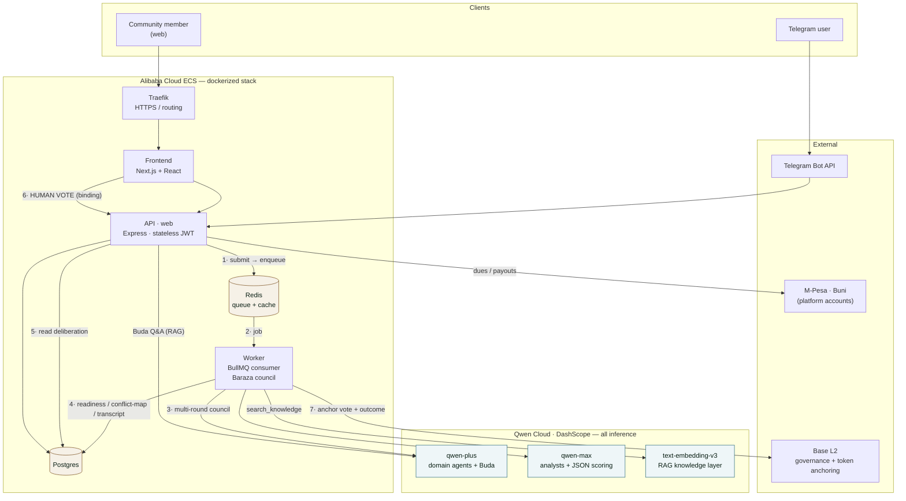

# UjamaaDAO – System Architecture

**Last updated:** July 2026

---

## High-Level Overview

The whole dockerized stack runs on **Alibaba Cloud ECS**; **all AI inference is Qwen Cloud (DashScope)**. The multi-agent **Baraza council is advisory** — it informs the human vote, it never decides.



**Flow:** (1) a member submits a proposal to the stateless **API**, which **enqueues** a deliberation to **BullMQ/Redis** and returns immediately; (2) a **worker** picks it up; (3) it runs the **Baraza council** (domain panel + analysts + historian + values voice, convened by Mjamaa) over structured rounds on **Qwen** (`qwen-plus`/`qwen-max`) with **`text-embedding-v3`** RAG; (4) it writes the readiness score, conflict map, and full transcript to Postgres; (5) the frontend renders them; (6) **humans vote — the binding decision** (the AI never votes, moves funds, or gates a proposal); (7) the worker **anchors** the vote + outcome on **Base L2**. The council is async so the ~4–6 min run never blocks the API, and every AI call is **fail-open**.

---

## Runtime Processes

Two fully decoupled processes run via Docker Compose:

| Process | Entry point | Purpose |
|---|---|---|
| `web` | `backend/src/index.ts` | REST API, serves all HTTP traffic |
| `worker` | `backend/src/workers.ts` | Background jobs + event listeners (no HTTP) |

Both connect to the same Postgres and Redis. Secrets with blast radius (`MINTER_PRIVATE_KEY`, `TELEGRAM_BOT_TOKEN`, `DISCORD_BOT_TOKEN`) are on the `worker` env only — never `web`.

---

## Data Stores

| Store | Docker service | Host port | Purpose |
|---|---|---|---|
| PostgreSQL | `postgres` | 5432 | Primary database (Prisma ORM) |
| PostgreSQL test | `postgres_test` | 5433 | Isolated test DB |
| Redis | `redis` | 6380 | Rate limiting, sessions, BullMQ queues |
| MailHog | `mailhog` | 1025 (SMTP) · 8025 (UI) | Dev email catcher |
| Anvil | `ujamaa_anvil` | 8545 | Local EVM for blockchain dev |

---

## API Routes

All routes are mounted at `/api/v1/` in `backend/src/app.ts`.

| Module | Prefix | Status | Tests |
|---|---|---|---|
| auth | `/api/v1/auth` | tested | 104 |
| user | `/api/v1/users` | tested | 35 |
| economy | `/api/v1/economy` | tested | 66 |
| community | `/api/v1/community` | tested | 147 |
| conflicts | `/api/v1/conflicts` | tested (community) | — |
| governance | `/api/v1/governance` | tested | 121 |
| elections | `/api/v1/elections` | tested | 63 |
| projects | `/api/v1/projects` | tested | 127 |
| marketplace | `/api/v1/marketplace` | tested | 35 |
| notifications | `/api/v1/notifications` | tested | 43 |
| emergency | `/api/v1/emergency` | tested | 30 |
| audit | `/api/v1/audit` | tested | 31 (includes feed) |
| feed | `/api/v1/feed` | tested (audit) | — |
| onboarding | `/api/v1/onboarding` | tested | 22 |
| reputation | `/api/v1/reputation` | tested | 27 |
| education | `/api/v1/education` | tested | 42 |
| integration | `/api/v1/integration` | tested | 30 |
| treasury | `/api/v1/treasury` | tested | 40 |
| payments | `/api/v1/payments` | tested | 50 |
| admin | `/api/v1/admin` | tested | 50 |
| platform-config | `/api/v1/platform-config` | tested (admin) | — |
| verification | `/api/v1/verify-community` | tested | 36 |

Health endpoints: `GET /health` · `GET /ready`

---

## Middleware Chain (Critical — order enforced in `app.ts`)

```
trust proxy → helmet/CORS → body parsing (10 MB limit)
→ context + correlation ID → request logging
→ global rate limiting → routes
→ cleanup → 404 handler → error handler
```

---

## Authentication

Three authentication methods — no passwords:

| Method | Flow |
|---|---|
| **Magic link (new user)** | `POST /auth/magic-link/send` (full profile) → hex token in email → `GET /auth/verify-email?token=<hex>` → `sessionToken` |
| **Magic link (returning)** | `POST /auth/magic-link/send` (email only) → JWT in email → `GET /auth/login?token=<jwt>` → `sessionToken` |
| **WebAuthn / passkey** | `POST /auth/passkeys/register/options` → browser `navigator.credentials.create()` → `POST /auth/passkeys/register/verify` — then login: `POST /auth/passkeys/login/options` → `navigator.credentials.get()` → `POST /auth/passkeys/login/verify` → `sessionToken` |
| **Wallet signature** | `POST /auth/wallet/nonce` → sign nonce → `POST /auth/wallet/verify` → `sessionToken` |

Token field: always `sessionToken`. Lifetime: 7 days. No short-lived/refresh rotation (ADR-022).

WebAuthn challenge storage: `WebAuthnChallenge` DB model, 5-minute TTL, keyed by `userId` (authenticated) or `email` (login flow).

---

## Verification Levels

```
UNVERIFIED
  └── EMAIL_VERIFIED        (after magic link verification)
       └── PHONE_VERIFIED   (after OTP)
            └── COMMUNITY_VERIFIED  (3 vouches or M-Pesa payment)
                 └── FULL_VERIFIED  (location proof — planned)
```

Most protected routes require `COMMUNITY_VERIFIED`. 2FA and wallet routes require `FULL_VERIFIED`.

---

## Background Jobs & Queues

Six BullMQ queues, all visible on Bull Board at `/admin/queues`:

| Queue | Jobs |
|---|---|
| `economy` | `monthly-pr-regeneration` (1st of month), `monthly-pr-inactivity-decay` (1st of month), `daily-commitment-penalties` (02:00), `dues-reminder` (08:00 daily, fires days 26–28 only) |
| `governance` | `schedule-elections` (1st of month 01:00), `open-nominations` (daily 00:15), `open-voting` (daily 00:20), `tally-results` (daily 00:25) |
| `user-cleanup` | `user-cleanup` (every 4h), `auth-cleanup` (03:00) |
| `notifications` | Dues-reminder delivery (scheduled above) |
| `integration` | `BARAZA_ATTENDANCE_REWARD`, `BARAZA_SEND_INVITE`, `BARAZA_SESSION_REMINDER` (event-triggered, not scheduled) |
| `dead-letter` | Failed jobs after max retries — logged + enqueued here, `sendJobFailureAlert` fires |

All new repeatable jobs must register in `backend/src/core/jobs/register.ts`.

---

## Event Bus

Cross-module communication uses the internal event bus (`backend/src/core/utils/eventBus.ts`).
Direct imports between modules are forbidden — use events.

| Event | Emitted by | Listeners |
|---|---|---|
| `user.created` | auth | economy, community, audit |
| `user.email.verified` | auth | economy (awards PR), community (enrolls system groups), audit |
| `auth.login` | auth | audit |
| `economy.commitment.breached` | economy | (no listeners yet) |

All new events must be typed in the event bus types file and documented here.

---

## Blockchain (Base L2)

**Status:** Deployed + device-tested on **Base Sepolia**; user-signed gasless voting verified on-chain. **Base mainnet deferred** (gated on funds + before the first real proposals — see `project_prod_deployment` / `onchain-integrity-roadmap`). On-chain layer is null-guarded — the off-chain DB is the source of truth until mainnet.

| Component | Status |
|---|---|
| `PrToken.sol` — soulbound ERC-20 | Deployed Sepolia `0xb07a…DbA7` |
| `UtToken.sol` — standard ERC-20 | Deployed Sepolia `0x6265…e040` |
| `GovernanceVoting.sol` — **user-signed** | Deployed Sepolia `0x5f43…E43B` (supersedes `0x27dd…31e5`). `castVote(id,option)` with `msg.sender`=voter (platform can't forge); `openProposal(id, contentHash)` anchors the proposal content hash; worker drives open/close/recordResult. **39/39 Foundry tests** |
| Gasless sponsorship | **Pimlico paymaster backend proxy** (ERC-7677) on `web` — allowlists only `castVote`; key server-held (`POST /api/v1/governance/paymaster`) |
| Backend contract clients | `getPrContract()` / `getUtContract()` / `getGovernanceContract()`, null-guarded; on-chain reads/verify need blockchain env on **web** AND worker |
| On-chain mint (PR award) | `participationRights.service.ts`, triple-guarded |
| Local dev via Anvil | `ujamaa_anvil` container on :8545 |

**Hybrid model (ADR-002):** On-chain = PR token, UT token, governance votes (user-signed) + proposal content-hash + result attestation. Off-chain = profiles, discovery, education, emergency, chat, notifications.

**Wallets:** passkey-secured **Coinbase Smart Wallet** (default-trustless self-custody; secp256r1 signer in the device secure enclave) via wagmi + viem + `@coinbase/wallet-sdk`. Privy was removed in the wallet rework (session 96). See `project_wallet_rework`.

---

## AI Layer (Qwen)

All AI runs through one shared, provider-agnostic client — `backend/src/core/ai/qwen.ts` — talking to **Alibaba DashScope** (Qwen Cloud, OpenAI-compatible) via the `openai` SDK. Everything is null-guarded and **dormant until `DASHSCOPE_API_KEY` is set** (no throws when absent).

Three features ride on it:

| Feature | Where it runs | What it does |
|---|---|---|
| **Baraza Q&A bot** | web (Telegram webhook) — `integration/services/baraza-ai.service.ts` | Free-text Q&A in ward Telegram groups; 6 DB tools. |
| **Deliberation digest** | worker — `governance/services/deliberation.service.ts` | Neutral-clerk summary of *human* annotations (support/concerns/open-questions) at voting-open. |
| **Baraza deliberation engine** | worker — `governance/baraza/` | 7-agent council that debates a proposal *before* the vote → readiness score + conflict map. See `docs/baraza-deliberation.md`. |

- **Models:** `qwen-plus` (domain agents + Q&A bot) / `qwen-max` (analysts + JSON extraction/scoring). Env: `BARAZA_AI_MODEL`, `BARAZA_ANALYST_MODEL`, `DASHSCOPE_BASE_URL`.
- **Info-fetching:** Shahidi (fact-checker) verifies external/current claims with a real **`web_search` function tool** (Tavily, via `completeWithTools` — the pattern Qwen's own reference agents use; DashScope's `enable_search` flag is silently ignored on the intl endpoint, so we don't rely on it). Activated by `TAVILY_API_KEY`; fail-open (no key → Shahidi reasons from context and is instructed not to assert unverifiable current facts). Deliberation agents also call read-only, group-scoped DB tools for real local data.
- **Provider is env-switchable** (the OpenAI-compatible path is the point): hackathon → DashScope Qwen; post-hackathon → DO Qwen3-32B (swap base URL/key/model); Claude later would re-add an Anthropic client path. The shared client keeps `getClaudeClient`/`isClaudeAvailable` aliases from when this was Claude-based (migrated 2026-06-25).

---

## Frontend

Next.js 16.1.6, React 18, TypeScript, Tailwind CSS, shadcn/ui, TanStack Query, wagmi + viem (Coinbase Smart Wallet).

**Dev:** `next dev --turbopack` (port 3000)
**API client:** `frontend/lib/api.ts` — `authApi`, `userApi`, `economyApi`, `communityApi`, `governanceApi`, `projectApi`, `marketplaceApi`, `emergencyApi`, `onboardingApi`, `reputationApi`, `educationApi`, `integrationApi`, `notificationsApi`
**Auth context:** `frontend/contexts/auth-context.tsx` — magic link flow, auto-hydrate from localStorage
**Wallet context:** `frontend/contexts/wallet-context.tsx` — Coinbase Smart Wallet via wagmi (passkey connect → ERC-6492 sign → `/auth/wallet/link`); `lib/wagmi.ts`, `lib/paymaster.ts` (gasless via the backend Pimlico proxy), `lib/governance-contract.ts` (user-signed `castVote`)

---

## Security

- **Helmet** — CSP/HSTS only in production.
- **CORS** — `ALLOWED_ORIGINS` env var (comma-separated). Defaults to `localhost:3000/3001`.
- **Rate limiting** — global + per-endpoint + dual (IP + per-user) on write endpoints.
- **RBAC** — `backend/src/core/rbac/roles.ts` — system roles: `SUPER_ADMIN`, `COMPLIANCE_OFFICER`, `COUNTY_COORDINATOR`, `BLOCKCHAIN_ADMIN`, `CONTRACT_DEPLOYER`, `MULTISIG_SIGNER`.
- **Correlation IDs** — `X-Correlation-ID` header generated per request, exposed in response.
- **Request body limit** — 10 MB.
- **Secrets** — `ENCRYPTION_KEY` (64-char hex) required for TOTP/2FA. Generate: `openssl rand -hex 32`.

---

## Dev Port Map

| Service | Host Port |
|---|---|
| Backend API | 4000 |
| Frontend | 3000 |
| Postgres | 5432 |
| Postgres test | 5433 |
| Redis | 6380 |
| MailHog SMTP | 1025 |
| MailHog UI | 8025 |
| Anvil (EVM) | 8545 |

Traefik is **disabled** in dev (ADR-023). Direct port access only.

---

## Key File Paths

| What | Path |
|---|---|
| App entry | `backend/src/app.ts` |
| Web server | `backend/src/index.ts` |
| Worker entry | `backend/src/workers.ts` |
| Docker Compose | `docker/docker-compose.yml` |
| Makefile | `backend/Makefile` |
| Jobs registry | `backend/src/core/jobs/register.ts` |
| Blockchain client | `backend/src/core/blockchain/client.ts` |
| Contracts | `contracts/src/PrToken.sol`, `contracts/src/UtToken.sol` |
| Frontend API client | `frontend/lib/api.ts` |
| Frontend auth context | `frontend/contexts/auth-context.tsx` |

---

## Observability

- **Logging** — Pino structured JSON, `operationType` field on every log line.
- **Sentry** — error tracking wired on both backend (Node.js SDK) and frontend (Next.js SDK). Captures unhandled exceptions, BullMQ job failures, and frontend component errors.
- **DataDog APM** — application performance monitoring wired on the backend. Traces, metrics, and distributed request tracing.
- **BrowserStack** — cross-browser/device testing wired for frontend QA.
- **Bull Board** — `/admin/queues` (HTTP basic auth: `admin` / `DASHBOARD_PASSWORD`). All 6 queues visible.
- **Audit log** — `GET /api/v1/audit/search` returns real records. 6+ active audit events: `USER_CREATED`, `EMAIL_VERIFIED`, `PR_AWARDED`, `PR_SPENT`, `DUES_PAID`, `COMMITMENT_CREATED`.
- **Activity feed** — `GET /api/v1/feed` — cursor-paginated, auth-required, privacy-safe stream of 9 event types with deep-links.
- Prometheus + Grafana + Loki + Jaeger are configured but **disabled by default** in the Docker Compose.
