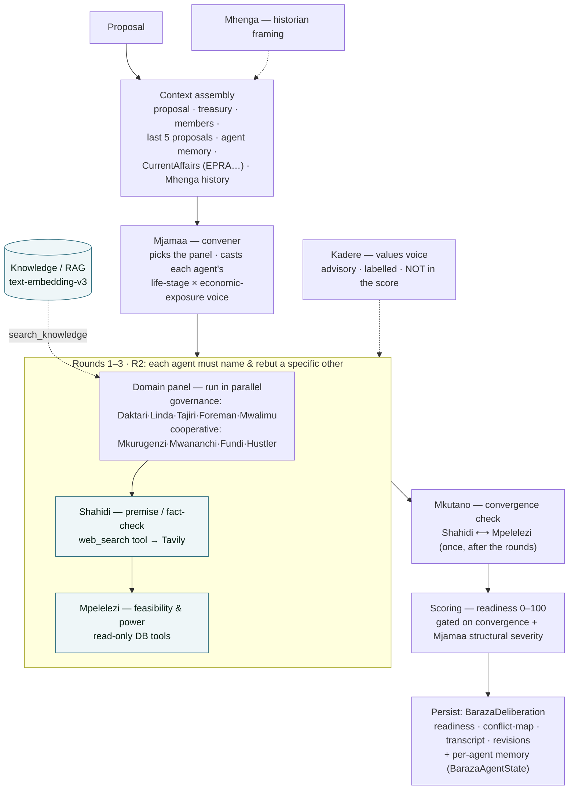

# Baraza Deliberation Engine

> **Module status:** `implemented + verified live` (session 102; branch `feat/baraza-deliberation`, not pushed). Active when `DASHSCOPE_API_KEY` is set (it is, in dev). **Extended by the council redesign** — career/archetype agent names, adaptive panels by proposal nature, per-proposal voice casting, and current-affairs + historical context — see [`baraza-panels-and-memory.md`](./baraza-panels-and-memory.md) (ADR-059). Built for the Qwen Cloud Global AI Hackathon (Agent Society track).
> Code: `backend/src/modules/governance/baraza/` · AI client: `backend/src/core/ai/qwen.ts`

---

## Overview

Baraza is a **multi-agent deliberation engine** that stress-tests a community proposal **before** it reaches a real vote. A council of AI agents — a **domain panel chosen by the proposal's nature** plus cross-cutting analysts, convened by **Mjamaa** — debates the proposal in structured rounds and produces a conflict map, credibility annotations, an implementability assessment, a readiness score (0–100), and revision suggestions. (Note: UjamaaDAO is **not the government** — these are communities of any kind acting on what they collectively care about; the domain agents are *lenses*, not ministries.)

This is distinct from two existing features — don't confuse them:
- **Baraza Telegram bot** (`baraza-topology.md`, `integration-api.md`) — conversational Q&A in Telegram groups.
- **Deliberation summary** (`deliberation.service.ts`) — a "neutral clerk" that summarises *human* annotations into support/concerns/open-questions. Baraza is agents debating *on their own*, before human annotation.

The binding decision is always the human vote. Baraza is guidance, never a verdict.

---

## The agents

**Relabelled and expanded** (session 102, ADR-059 — labels are career/archetype names, roles unchanged). Full design: [`baraza-panels-and-memory.md`](./baraza-panels-and-memory.md).

**Domain agents** — a panel chosen **by proposal nature** (deterministic, drawn from the full roster, with community type as the fallback):

| Panel | Agents |
|---|---|
| Governance (system groups) | **Daktari** (health/welfare) · **Linda** (land/environment) · **Tajiri** (economy) · **Foreman** (infrastructure) · **Mwalimu** (education/social) |
| Cooperative (voluntary groups) | **Mkurugenzi** (finance) · **Mwananchi** (member-equity) · **Fundi** (execution) · **Hustler** (market) |

Each domain agent argues from a **cast lived perspective** — a *life-stage × economic-exposure* voice that **Mjamaa** assigns per proposal, recorded on the deliberation as the agent's resolved identity (not fixed ministry-citizen archetypes anymore).

**Analyst agents** (annotate every panel, never debate):
- **Shahidi** (Truth; was Ukweli) — premise interrogator. Flags `SOUND | QUESTIONABLE | CONTESTED | IDEOLOGICAL`. Uses **live web search**.
- **Mpelelezi** (Shadow; was Kivuli) — implementability/political-reality. Maps chokepoints + route-arounds. Uses **DB tools**.

**Framing voices** (run once, not per round, to bound cost):
- **Mjamaa** (convener / structure) — picks the panel, casts the domain voices, emits a **structural severity** that feeds the readiness score, keeps per-group memory, and runs a **closing review** of the proposed revisions.
- **Mhenga** (historian) — a **two-scale** voice: leads with the **community's own arc** (its past decisions + local timeline) as a *pattern*, and pulls in the **shared national arc** only when it's load-bearing (register gate). Provenance-tracked `HistoricalEvent` timeline (`groupId` null = national, set = group-local). Full design: [`baraza-historian-and-values.md`](./baraza-historian-and-values.md).

**Context injected into every deliberation:** present conditions (`CurrentAffairs` collectors — EPRA fuel, @moneyacademyKE, best-effort/fail-open) and Mhenga's historical framing.

**Asymmetry:** Shahidi never sees Mpelelezi before writing; Mpelelezi always sees Shahidi. They meet once, after the rounds, in **Mkutano** (a convergence check, not a debate).

---

## Debate flow (AI-layer architecture)

This is the internal pipeline of the "Baraza council" box in the [system architecture](./architecture.md) — the worker-driven, multi-agent deliberation that runs on Qwen before any human vote.



The Round-2 "name a specific agent and rebut" constraint is what produces genuine disagreement instead of parallel monologues. Shahidi and Mpelelezi annotate each round but only meet in **Mkutano**; the framing voices (Mjamaa, Mhenga) and Kadere run once, not per round, to bound cost.

### Readiness score (0–100)

```
base = consensus ratio across 5 domain agents (LLM-extracted)
+ coalition bonus      (+5 each, cap +15)
- isolation penalty    (-10 per high-intensity 2-agent conflict, cap -20)
- Mkutano convergence  (-8 per convergence point, cap -24)   ← most serious signal
+ Mkutano contradiction(+3 each, cap +9)
- chokepoint penalty   (-8 per HIGH chokepoint with no route-around, cap -16)
```

Bands: `READY` 85–100 · `CONDITIONAL` 65–84 · `SIGNIFICANT_CONCERNS` 40–64 · `NOT_READY` <40.

---

## Agent memory (per group)

Each `(groupId, agentKey)` pair has persistent memory so a group's agents accumulate real argumentative history — "agent society," not stateless chatbots. Three layers: **static core** (immutable identity), **episodic log** (last 50 deliberations), **relational map** (last 20 interactions per other agent). Ukweli additionally keeps a *premise pattern library*; Kivuli a *power-structure map*. Behavioural scores (`rigidityScore`, `responsivenessScore`) nudge after each run and feed score weighting.

---

## Data model

- **`BarazaDeliberation`** (`baraza_deliberations`) — one row per run. Key fields: `contentHash` (dedup), `status` (PENDING/RUNNING/COMPLETE/FAILED), `triggeredBy`, `readinessScore`/`readinessBand`, `transcript`, `conflictMap`, `revisionSuggestions`, `mkutano*`, `contextSnapshot`, `agentMemorySnapshot`, `errorLog`.
- **`BarazaAgentState`** (`baraza_agent_states`) — per `(groupId, agentKey)`; the 3-layer memory + counters + behavioural scores.
- Back-relations: `Proposal.deliberations`, `Group.deliberations`, `Group.agentStates`.

---

## Triggers & endpoints

Runs as a BullMQ job (`BARAZA_DELIBERATION`) on the governance queue/worker. Content-hash deduped — an unchanged proposal reuses the existing COMPLETE deliberation.

| Trigger | Where | `triggeredBy` |
|---|---|---|
| Fast-track approval | `proposal-lifecycle.service.ts` → `tryVoluntaryGroupScopeFastTrack` | `AUTO` |
| Admin approval | `handlePendingReviewStage` (APPROVE → APPROVED_FOR_VOTING) | `ADMIN` |
| Author, pre-submission | `POST /api/v1/proposals/:proposalId/baraza` (creator-gated) | `AUTHOR` |

| Endpoint | Auth | Purpose |
|---|---|---|
| `GET /api/v1/proposals/:proposalId/baraza` | member | Latest COMPLETE deliberation (null if none) |
| `POST /api/v1/proposals/:proposalId/baraza` | proposal author | Queue a deliberation |

**Telegram output** (`baraza-telegram.service.ts`): posts an in-progress notice, then the formatted result (bilingual SW/EN headers, emoji sections, split under Telegram's 4096-char limit), or a failure notice. No-op if Telegram isn't configured or the group has no active Telegram baraza.

**Web output** (`components/governance/baraza-deliberation.tsx`): the proposal detail page reads `governanceApi.getBaraza(proposalId)` (→ `GET /governance/:proposalId/baraza`) and renders `BarazaDeliberationCard` — readiness band + score, consensus / coalitions / conflicts / unresolved / chokepoints / Mkutano convergence / fixability / revision suggestions, with the "AI stress-test, not a verdict — your vote is binding" disclaimer. Read-only and self-gating (renders nothing until a COMPLETE deliberation exists).

---

## AI provider & info-fetching

Powered by **Alibaba DashScope** (Qwen Cloud, OpenAI-compatible) via `core/ai/qwen.ts` (which replaced `claude.ts`; keeps `getClaudeClient`/`isClaudeAvailable` aliases). Models: `qwen-plus` (domain agents) / `qwen-max` (analysts + JSON extraction/scoring). The path is OpenAI-compatible, so the **post-hackathon fallback is DO's Qwen3-32B** (swap base URL + key + model id, no code change); Claude-later would re-add the Anthropic client path.

Agents argue from **real data**, not just model priors:
- **Ukweli — live web search:** `completeWithSearch()` uses DashScope's server-side `enable_search` (`forced_search:false` + citations), folded into the answer. Falls back to a plain completion on error.
- **Domain agents (Round 1) + Kivuli (every round) — DB tools:** `completeWithTools()` + `agents/tools.ts` expose read-only, group-scoped tools — `get_ward_stats`, `get_group_treasury`, `search_past_decisions`, `get_election_results`. Domain agents fetch only in Round 1 (rounds 2–3 react to the transcript) to bound cost; Kivuli fetches each round.

### Environment

Set on **web** (Telegram bot) and **worker** (engine) in `docker-compose.yml` + `docker-compose.prod.yml`:

| Var | Default | Notes |
|---|---|---|
| `DASHSCOPE_API_KEY` | _(unset → dormant)_ | The on/off switch |
| `DASHSCOPE_BASE_URL` | intl OpenAI-compat endpoint | Override for mainland / DO / proxy |
| `BARAZA_AI_MODEL` | `qwen-plus` | Domain agents + Q&A bot |
| `BARAZA_ANALYST_MODEL` | `qwen-max` | Ukweli / Kivuli |
| `DELIBERATION_AI_MODEL` | `qwen-plus` | Legacy deliberation-summary model |

Everything is null-guarded: with no key, the engine and bot are dormant (no throws).

---

## Dev vs prod

Code is identical; config is env-driven. **Two prod-specific steps** are required or it stays dormant/broken on prod:
1. **Create the tables on the prod DB.** Dev + test got them via `prisma db push` (no clean migration was possible due to pre-existing dev-DB migration drift). Prod deploys via `migrate deploy`, so run a one-time `db push` against prod.
2. **Set `DASHSCOPE_API_KEY` in `docker/.env.prod`**, then rebuild web + worker.

**Cost/quota note:** one deliberation is ~25–40 Qwen calls (3 rounds × 7 agents + tool round-trips + Mkutano + 2 JSON extractions), several on `qwen-max`. If prod points at the hackathon DashScope key, real prod proposals consume hackathon quota — the argument for switching prod to DO Qwen3-32B post-hackathon.

---

## Verification

- `tsc --noEmit` 0 · `npm run lint` 0 errors · governance suite **171/171** (engine dormant under test).
- **Live end-to-end requires `DASHSCOPE_API_KEY`** (not yet run): set the key, recreate web+worker, then forward a seeded proposal to `APPROVED_FOR_VOTING` (or `POST …/baraza`) and confirm a `BarazaDeliberation` reaches COMPLETE with a score + conflict map, agent memory rows are written, content-hash dedup skips a re-run, and the Telegram post renders.

---

## Known limitations / follow-ups

- **Proposal context richness:** the create form collects `problem`/`solution` but folds them into `description` (the structured `Proposal.problem`/`solution` columns stay null). Agents still get the content via `description`; sending discrete fields is a nice-to-have polish.
- **Prod migration** is a manual `db push` (see above) until the migration drift is reconciled.
- **Frontend:** a read-only text card (`BarazaDeliberationCard`) on the proposal page now surfaces the full record; a richer **D3 conflict-map visualization** remains a stretch goal.
- **Outcome backfill:** episodic `proposalOutcome` is written as `PENDING` and not yet updated retroactively when the proposal is later approved/rejected.
